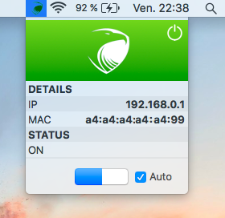
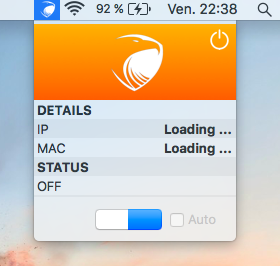

# Aegis 

Aegis is a macOS app written in Swift that detects ARP spoofing by monitoring the state of your Mac’s ARP table.

## How it works

 
 

  1. Start the app. After some seconds, it will display the IP and MAC address of the Wi-Fi access point you are connected to.
  2. Click on the switch to activate the protection for that Wi-Fi AP (be sure that its MAC address checks out first!).
  3. To have Aegis automatically turn on when you are connected to that AP, click on the “Auto” checkbox.

## More information 

Our blogpost about Aegis: https://securemonkeys.wordpress.com/aegis/

---

## Icon art

[Link](http://all-free-download.com/free-vector/download/eagle-shield_312030.html) (free for commercial use with attribution)

